# E-Commerce Database

A relational database schema for an e-commerce application, built using **Microsoft SQL Server**. This project defines the core tables, relationships, constraints, and sample data required to manage products, customers, orders, inventory, payments, shipping, and reviews.

---

## Database: `ECommerce`

```sql
CREATE DATABASE ECommerce;
USE ECommerce;
```

---

## Tables

### `categories`
Stores product categories.

```sql
CREATE TABLE categories
(
   category_id INT IDENTITY(1,1) PRIMARY KEY,
   category_name VARCHAR(60)
);
```

---

### `products`
Stores product details. Each product belongs to a category.

```sql
CREATE TABLE products
(
    product_id INT IDENTITY(1,1) PRIMARY KEY,
    product_name VARCHAR(50) NOT NULL,
    category_id INT,
    created_at DATETIME,
    price DECIMAL(20,2),
    FOREIGN KEY (category_id) REFERENCES categories(category_id)
);
```

---

### `customers`
Stores customer information.

```sql
CREATE TABLE customers
(
    customer_id INT IDENTITY(1,1) PRIMARY KEY,
    name VARCHAR(50),
    email VARCHAR(30) NOT NULL,
    phone VARCHAR(20),
    address VARCHAR(150),
    created_at DATETIME
);
```

---

### `orders`
Stores order records placed by customers.

```sql
CREATE TABLE orders
(
    order_id INT IDENTITY(1,1) PRIMARY KEY,
    customer_id INT,
    order_date DATE,
    order_status VARCHAR(50),
    total_amount DECIMAL(20,2),
    FOREIGN KEY (customer_id) REFERENCES customers(customer_id)
);
```

---

### `order_items`
Stores individual line items within each order.

```sql
CREATE TABLE order_items
(
    order_item_id INT IDENTITY(1,1) PRIMARY KEY,
    product_id INT,
    order_id INT,
    price DECIMAL(10,2),
    quantity INT,
    FOREIGN KEY (order_id) REFERENCES orders(order_id),
    FOREIGN KEY(product_id) REFERENCES products(product_id)
);
```

> The `price` column captures the product price **at the time of purchase**, so historical order data is not affected by future price changes.

---

### `inventory`
Tracks stock quantity for each product.

```sql
CREATE TABLE inventory
(
    inventory_id INT IDENTITY(1,1) PRIMARY KEY,
    product_id INT,
    stock_quantity INT,
    last_updated DATE,
    FOREIGN KEY(product_id) REFERENCES products(product_id)
);
```

---

### `payments`
Stores payment information for each order.

```sql
CREATE TABLE payments
(
    payment_id INT IDENTITY(1,1) PRIMARY KEY,
    order_id INT,
    payment_method VARCHAR(30),
    payment_status VARCHAR(30),
    payment_date DATE,
    FOREIGN KEY (order_id) REFERENCES orders(order_id)
);
```

---

### `reviews`
Stores customer reviews and ratings for products.

```sql
CREATE TABLE reviews
(
    review_id INT IDENTITY(1,1) PRIMARY KEY,
    customer_id INT,
    product_id INT,
    review_date DATE,
    rating INT,
    FOREIGN KEY (customer_id) REFERENCES customers(customer_id),
    FOREIGN KEY (product_id) REFERENCES products(product_id)
);
```

---

### `shipping`
Tracks shipping details and delivery status for each order.

```sql
CREATE TABLE shipping
(
    shipping_id INT IDENTITY(1,1) PRIMARY KEY,
    order_id INT,
    shipping_address VARCHAR(200),
    shipped_date DATE,
    delivered_date DATE,
    shipping_status VARCHAR(30),
    FOREIGN KEY (order_id) REFERENCES orders(order_id)
);
```

---

## Entity Relationship Overview

| Relationship | Type |
|---|---|
| `categories` → `products` | One-to-Many |
| `customers` → `orders` | One-to-Many |
| `orders` → `order_items` | One-to-Many |
| `products` → `order_items` | One-to-Many |
| `products` → `inventory` | One-to-One |
| `orders` → `payments` | One-to-One |
| `customers` → `reviews` | One-to-Many |
| `products` → `reviews` | One-to-Many |
| `orders` → `shipping` | One-to-One |

---

## Key Design Decisions

- **`price` in `order_items`** is stored separately from `products.price` to preserve historical order pricing.
- **Foreign keys** are used throughout the schema to enforce referential integrity.
- **IDENTITY columns** are used for auto-incrementing primary keys.
- Inventory quantities are updated based on order transactions. :contentReference[oaicite:0]{index=0}
- Order totals are validated against `order_items` data. 

---

## File Structure

```text
E-Commerce-Database/
│
├── sql/
│   ├── create_tables/
│   │   ├── create_database.sql
│   │   ├── create_categories_table.sql
│   │   ├── create_customers_table.sql
│   │   ├── create_products_table.sql
│   │   ├── create_orders_table.sql
│   │   ├── create_order_items_table.sql
│   │   ├── create_inventory_table.sql
│   │   ├── create_payments_table.sql
│   │   ├── create_shipping_table.sql
│   │   └── create_reviews_table.sql
│   │
│   ├── insert_data/
│   │   ├── insert_categories.sql
│   │   ├── insert_customers.sql
│   │   ├── insert_products.sql
│   │   ├── insert_orders.sql
│   │   ├── insert_order_items.sql
│   │   └── insert_inventory.sql
│   │
│   └── analysis/
│       └── basic_analysis.sql
│
├── scripts/
│   └── generate_data.py
│
├── ER_Diagram.png
└── README.md
```

---

## Getting Started

### Step 1: Create Database and Tables

Run the scripts in this order:

```text
1. create_database.sql
2. create_categories_table.sql
3. create_customers_table.sql
4. create_products_table.sql
5. create_orders_table.sql
6. create_order_items_table.sql
7. create_inventory_table.sql
8. create_payments_table.sql
9. create_shipping_table.sql
10. create_reviews_table.sql
```

---

### Step 2: Insert Sample Data

Run the data insertion scripts in this order:

```text
1. insert_data/insert_categories.sql
2. insert_data/insert_customers.sql
3. insert_data/insert_products.sql
4. insert_data/insert_orders.sql
5. insert_data/insert_order_items.sql
6. insert_data/insert_inventory.sql
```

Sample data files include:
- Categories: Electronics, Clothing, Home & Kitchen, Sports & Outdoors, Books, Beauty & Personal Care, Toys & Games, Automotive, Health & Wellness, Office Supplies
- Products: Range includes electronics (headphones, speakers, laptops), clothing (shoes, jeans, shirts), home goods (coffee makers, air fryers), and more
- Customers: Realistic customer profiles with names, emails, phone numbers, and addresses
- Orders: Orders from 2023-2026 with various statuses (Delivered, Processing, Shipped, Cancelled, Refunded, Pending)
- Inventory: Stock levels ranging from 0-500 units with recent update timestamps

---

## Features

- Fully normalized relational database design
- Real-world e-commerce workflow support
- Historical price tracking
- Inventory management
- Order and shipping tracking
- Customer review management
- Sample dataset for testing SQL queries and analytics

---

## Data Generation (Python Script)

The sample data in `sql/insert_data/` was generated using Python with the **Faker** library to ensure realistic, synthetic data.

### Why Use Generated Data?

- **No real customer data** - All data is synthetic and safe for public repositories
- **Consistent format** - Follows database schema constraints
- **Realistic relationships** - Maintains referential integrity
- **Edge cases included** - NULL values, various statuses, date ranges
- **Reproducible** - Anyone can regenerate with different parameters

### Regenerate Sample Data

1. Install Faker:
   ```bash
   pip install faker

### Steps to use the python script
- Create a generate_data.py file in the main folder.
- Paste the given code into the file and run it.
- It will generate a file called **ecommerce_sample_data.sql**, where all the insert statements are included.
- You can run those insert statements on sql server to insert the data into tables.
- You can increase the volume of data by modifying the **generate_data.py**
  ```generate_data.py
    NUM_CATEGORIES = 10      # Number of categories
    NUM_CUSTOMERS  = 100     # Number of customers
    NUM_PRODUCTS   = 50      # Number of products
    NUM_ORDERS     = 200     # Number of orders
    NUM_REVIEWS    = 150     # Number of reviews
  ```
- Just change the numbers according to the volume of data you required and run it.

---

## Analysis

### 🟢 Basic Analysis
#### Q1. Total revenue generated by the e-commerce platform
```sql
SELECT SUM(total_amount) AS Total_Revenue
FROM orders;
```
**Output:** `Total_Revenue = 245670.50`
**Insight:** This represents the total sales revenue generated from all customer orders.

---

#### Q2. Total customers registered on the platform
```sql
SELECT COUNT(customer_id) AS Customer_Count
FROM customers;
```
**Output:** `Customer_Count = 100`
**Insight:** This shows the total number of customers currently registered.

---

#### Q3. Total products available in the inventory
```sql
SELECT COUNT(product_id) AS AvailProducts
FROM inventory;
```
**Output:** `AvailProducts = 50`
**Insight:** This indicates the total number of products currently tracked in stock.

## Tools Used

- **Microsoft SQL Server**
- **SQL Server Management Studio (SSMS)**
- **GitHub**


---
# 🛒 MycartDB — E-Commerce Database & Web Application

A full-stack e-commerce management system built using **Microsoft SQL Server** for the database and **Django (Python)** for the web application. This project covers complete database design, normalization, SQL analysis queries, and a fully functional web app with role-based authentication.

---

## 🛠️ Tech Stack


---

## 📌 Project Overview

| Property | Details |
|---|---|
| Database | ECommerce (Microsoft SQL Server) |
| Backend | Python — Django 6.0.4 |
| Frontend | HTML, CSS, Bootstrap 5 |
| DB Connector | pyodbc + mssql-django |
| Total Tables | 9 |
| Total Columns | 43 |
| Total Records | 200+ Orders, 100+ Customers, 50+ Products |
| Authentication | Role-based (Admin / User) |

---

## 🌐 Web Application Screenshots

### 🏠 Home Page
> Summary cards showing live data from SQL Server — Total Revenue, Customers, Products and Orders.

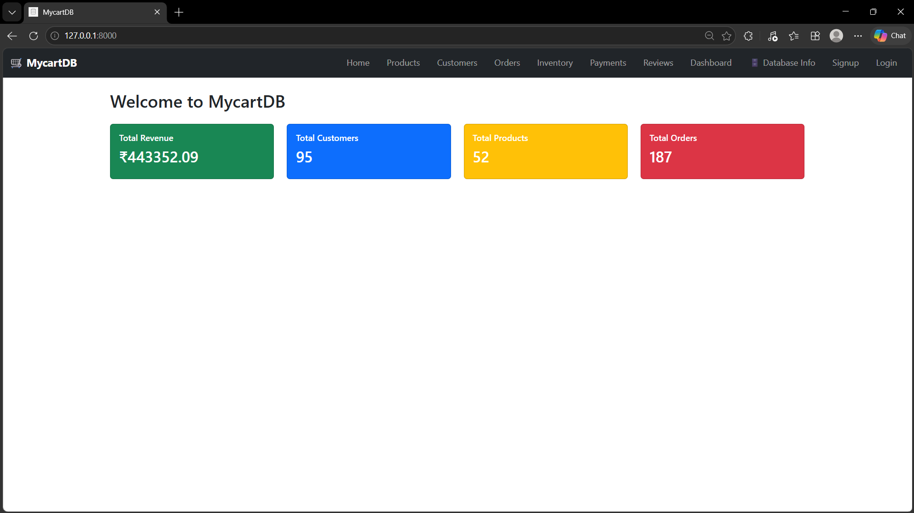

---

### 📦 Products Page
> All products fetched directly from the SQL Server `products` table with category and price.

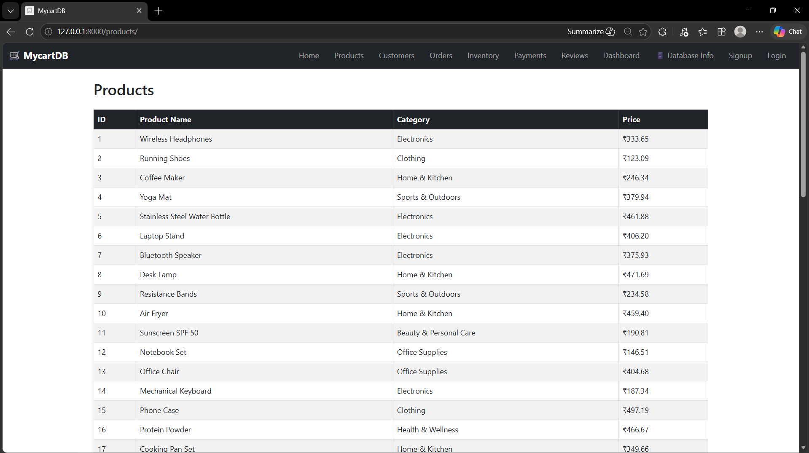

---

### 👥 Customers Page
> All registered customers from the `customers` table with complete details.

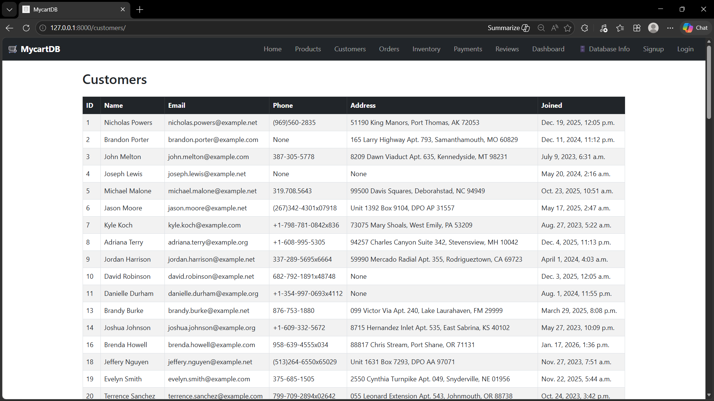

---

### 📋 Orders Page
> All orders with colour-coded status badges — Delivered, Processing, Shipped, Pending, Cancelled.

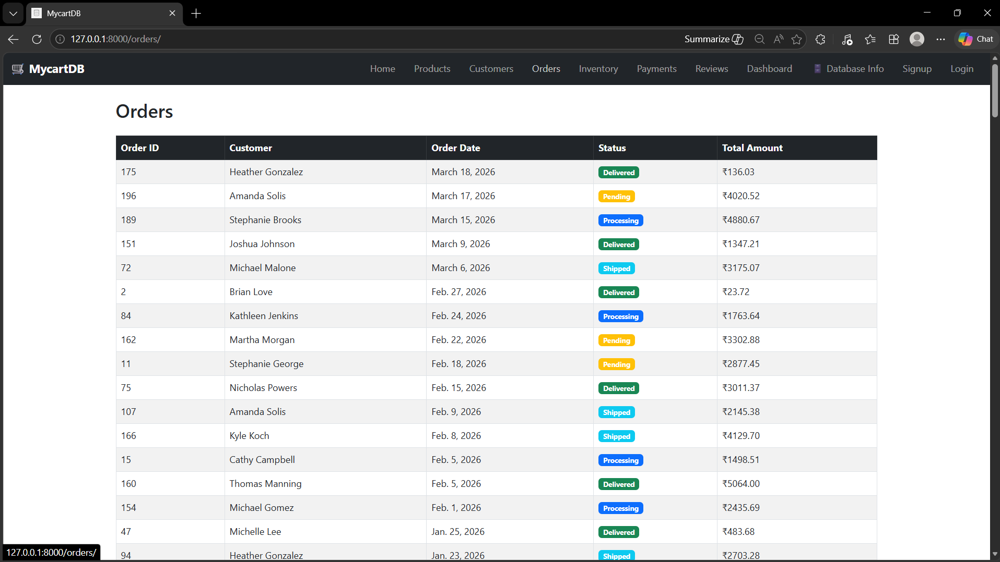

---

### 🗃️ Inventory Page
> Stock levels for all products with Out of Stock / In Stock badges.

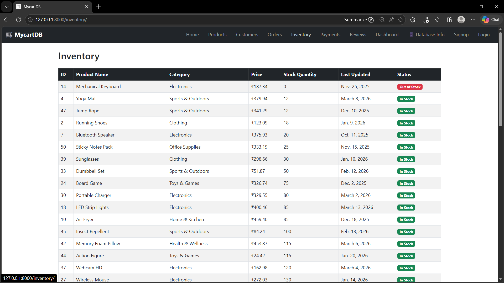

---

### 💳 Payments Page
> Payment records with method, status badges (Completed, Failed, Refunded) and amounts in ₹.

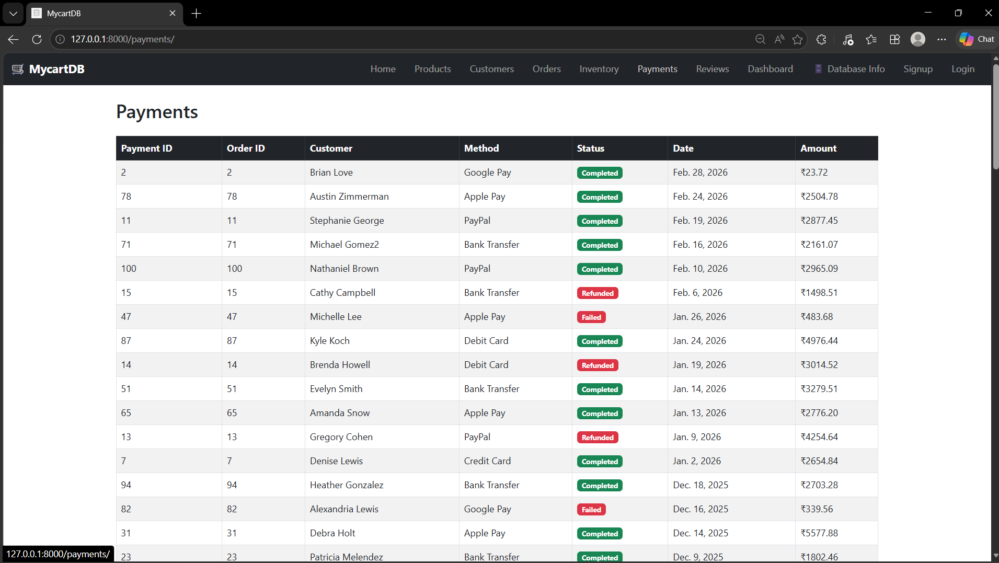

---

### ⭐ Reviews & Ratings Page
> Customer reviews with star ratings displayed for all products.

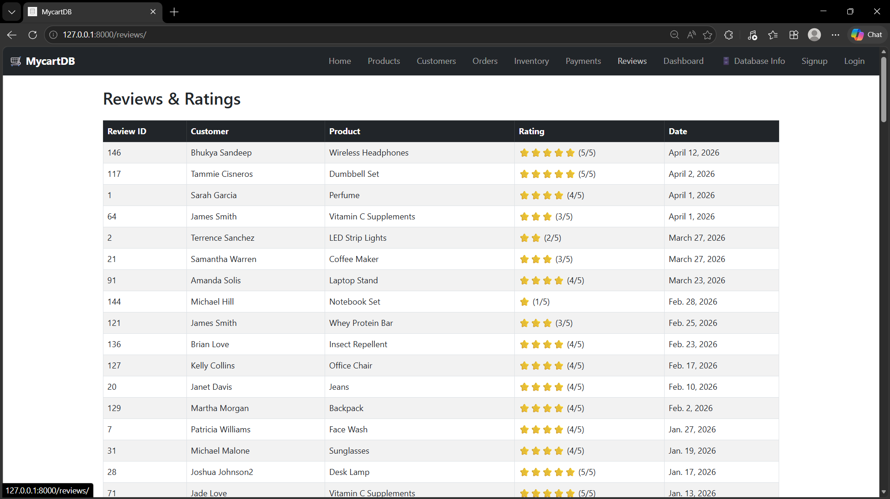

---

### 📊 Analytics Dashboard
> Live analytics dashboard powered by SQL queries and Chart.js visualizations.

**Dashboard — Stat Cards + Charts**
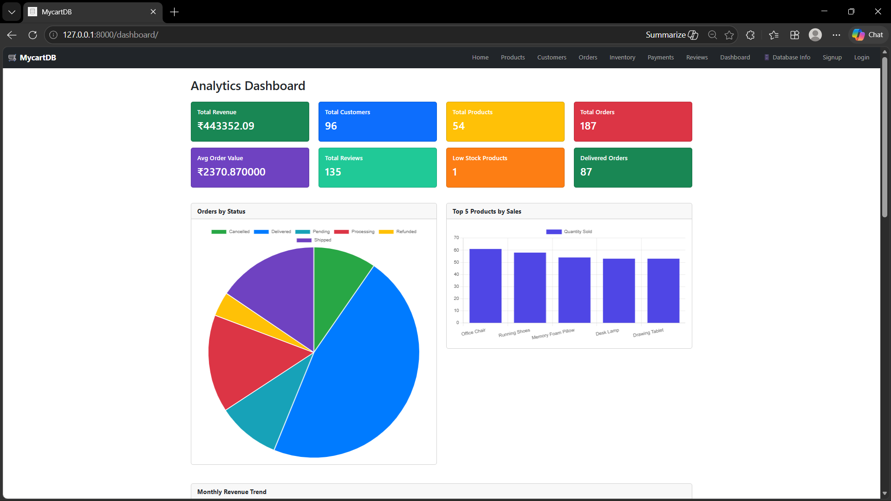

**Dashboard — Monthly Revenue + Category & Payment Charts**
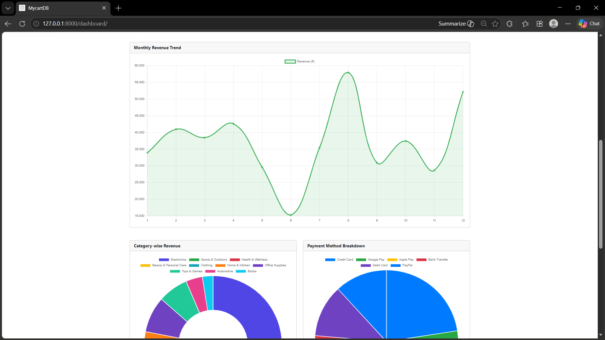

**Dashboard — Top Customers + Shipping Status**
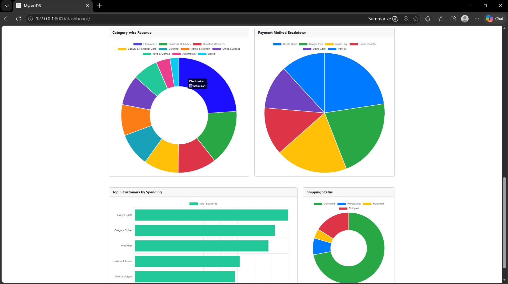

---

### 🗄️ Database Info Page
> Dedicated page showing ER Diagram, table structure, normalization, relationships and SQL queries.

**Database Overview & ER Diagram**
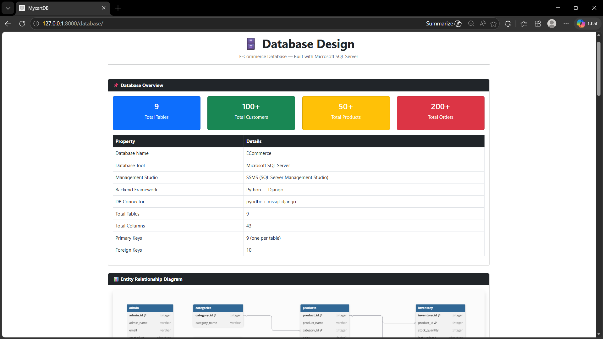

**Relationships, Normalization & Key Design Decisions**
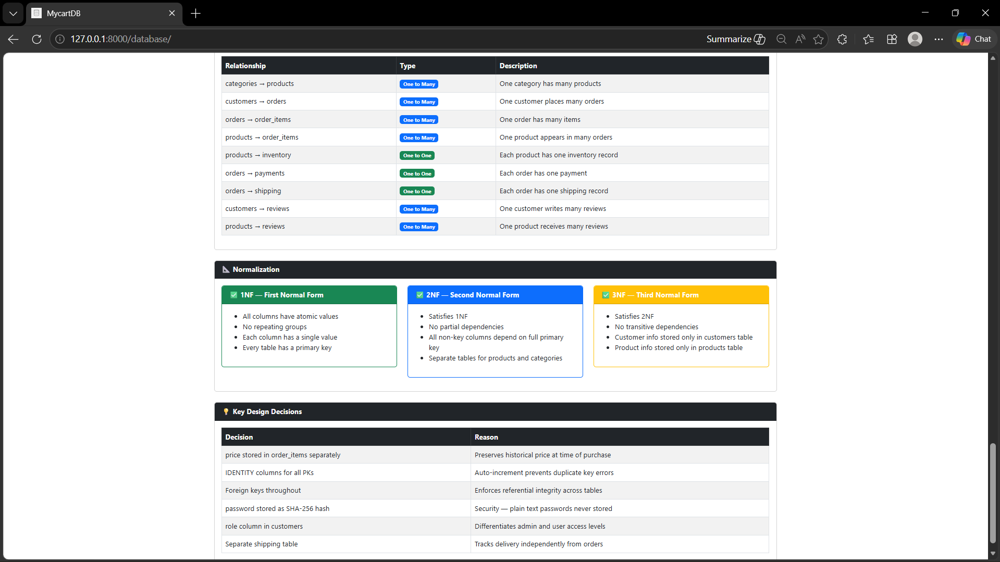

---

### 🔐 Authentication

**Signup Page** — Register as Admin or User
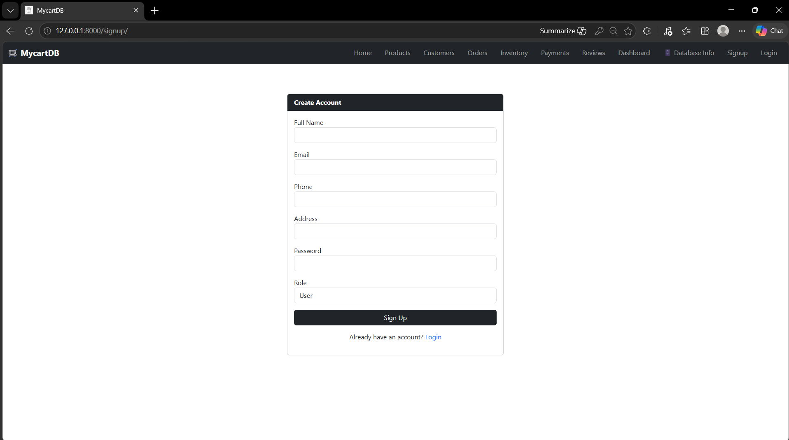

**Login Page** — Role-based login (Admin / User)
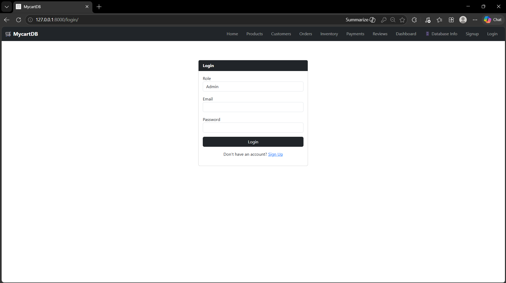

---

### 👑 Admin vs 👤 User Access

**Admin View** — Add Product button visible in navbar
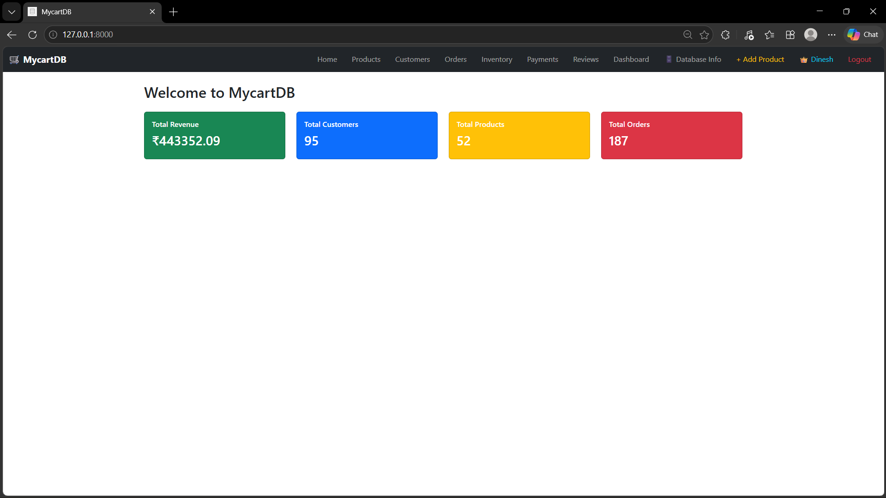

**User View** — No Add Product button
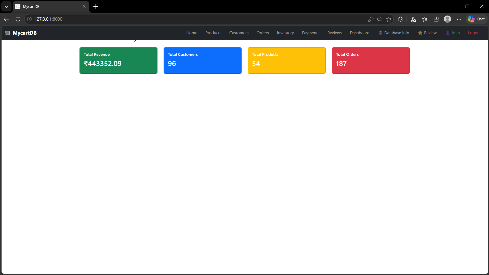

---

### ➕ Admin — Add Product
> Admin can add new products directly from the website. Data saves instantly to SQL Server.

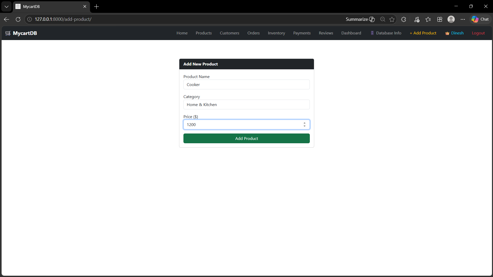

---

### ⭐ User — Add Review
> Logged-in users can submit star ratings for products. Saves to the `reviews` table.

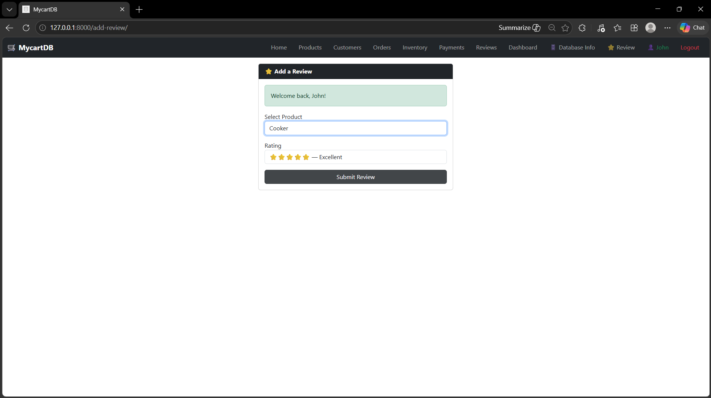

---

## 🗂️ Database Schema

### Tables Overview

| Table | Purpose | Key Columns |
|---|---|---|
| `categories` | Product categories | category_id, category_name |
| `products` | Product catalog | product_id, product_name, category_id, price |
| `customers` | Customer info | customer_id, name, email, password, role |
| `orders` | Order records | order_id, customer_id, order_status, total_amount |
| `order_items` | Order line items | order_item_id, order_id, product_id, price, quantity |
| `inventory` | Stock levels | inventory_id, product_id, stock_quantity |
| `payments` | Payment records | payment_id, order_id, payment_method, payment_status |
| `reviews` | Product ratings | review_id, customer_id, product_id, rating |
| `shipping` | Delivery tracking | shipping_id, order_id, shipped_date, delivered_date |

### Relationships

| Relationship | Type |
|---|---|
| categories → products | One-to-Many |
| customers → orders | One-to-Many |
| orders → order_items | One-to-Many |
| products → order_items | One-to-Many |
| products → inventory | One-to-One |
| orders → payments | One-to-One |
| orders → shipping | One-to-One |
| customers → reviews | One-to-Many |
| products → reviews | One-to-Many |

---

## 📐 Normalization

- **1NF** — All columns have atomic values, no repeating groups, every table has a primary key
- **2NF** — No partial dependencies, separate tables for products and categories
- **3NF** — No transitive dependencies, customer info stored only in customers table

---

---

## 🔐 Role-Based Authentication

| Feature | Admin | User |
|---|---|---|
| View all pages | ✅ | ✅ |
| Signup / Login | ✅ | ✅ |
| Add Product | ✅ | ❌ |
| Add Review | ✅ | ✅ |
| View Dashboard | ✅ | ✅ |

---

## 🚀 How to Run Locally

### Prerequisites
- Python 3.13+
- Microsoft SQL Server
- SSMS (SQL Server Management Studio)
- ODBC Driver 17 for SQL Server

### Step 1 — Set up the Database

Run scripts in this order in SSMS:

```
1. sql/create_tables/create_database.sql
2. sql/create_tables/create_categories_table.sql
3. sql/create_tables/create_customers_table.sql
4. sql/create_tables/create_products_table.sql
5. sql/create_tables/create_orders_table.sql
6. sql/create_tables/create_order_items_table.sql
7. sql/create_tables/create_inventory_table.sql
8. sql/create_tables/create_payments_table.sql
9. sql/create_tables/create_shipping_table.sql
10. sql/create_tables/create_reviews_table.sql
```

### Step 2 — Insert Sample Data

```
1. sql/insert_data/insert_categories.sql
2. sql/insert_data/insert_customers.sql
3. sql/insert_data/insert_products.sql
4. sql/insert_data/insert_orders.sql
5. sql/insert_data/insert_order_items.sql
6. sql/insert_data/insert_inventory.sql
```

### Step 3 — Set Up Web App

```bash
cd webapp
pip install django pyodbc mssql-django
```

Update `webapp/ecommerce/settings.py`:

```python
DATABASES = {
    'default': {
        'ENGINE': 'mssql',
        'NAME': 'ECommerce',
        'HOST': 'YOUR_SERVER_NAME',
        'PORT': '',
        'OPTIONS': {
            'driver': 'ODBC Driver 17 for SQL Server',
            'trusted_connection': 'yes',
        },
    }
}
```

### Step 4 — Run the App

```bash
py -3.13 manage.py migrate
py -3.13 manage.py runserver
```

Open browser: `http://127.0.0.1:8000`

---

## 📁 File Structure

```
E-Commerce-Database/
│
├── sql/
│   ├── create_tables/          ← All table creation scripts
│   ├── insert_data/            ← Sample data scripts
│   └── analysis/               ← SQL analysis queries
│
├── webapp/                     ← Django web application
│   ├── ecommerce/
│   │   ├── settings.py
│   │   └── urls.py
│   ├── store/
│   │   ├── views.py
│   │   ├── urls.py
│   │   └── templates/store/
│   ├── static/
│   └── manage.py
│
├── screenshots/                ← All page screenshots
├── scripts/
│   └── generate_data.py        ← Python Faker data generator
├── ER_Diagram.png
├── .gitignore
└── README.md
```

---


## 🛠️ Tools Used

- **Microsoft SQL Server** — Database
- **SQL Server Management Studio (SSMS)** — DB Management
- **Python 3.13 + Django 6.0.4** — Backend
- **Bootstrap 5** — Frontend Styling
- **Chart.js** — Dashboard Charts
- **pyodbc + mssql-django** — DB Connector
- **VS Code** — Code Editor
- **GitHub** — Version Control

---

## 👨‍💻 Author

**Paloju Dinesh**
- GitHub: [@Dinesh393](https://github.com/Dinesh393)

---

> ⭐ If you found this project helpful, consider giving it a star on GitHub!
